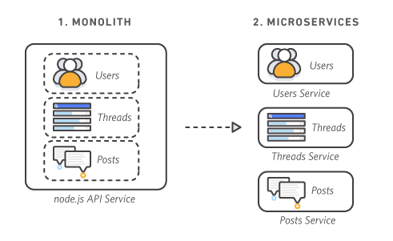
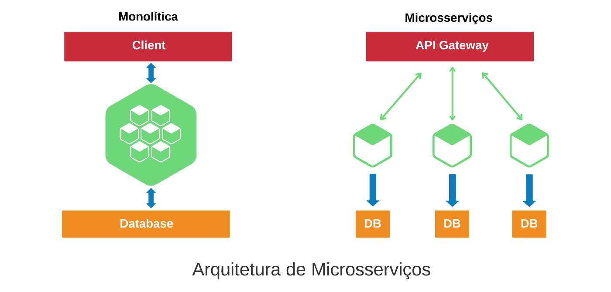
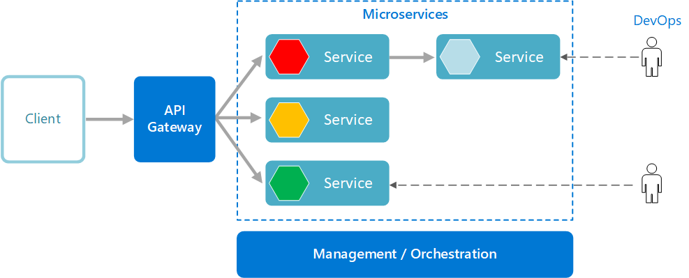
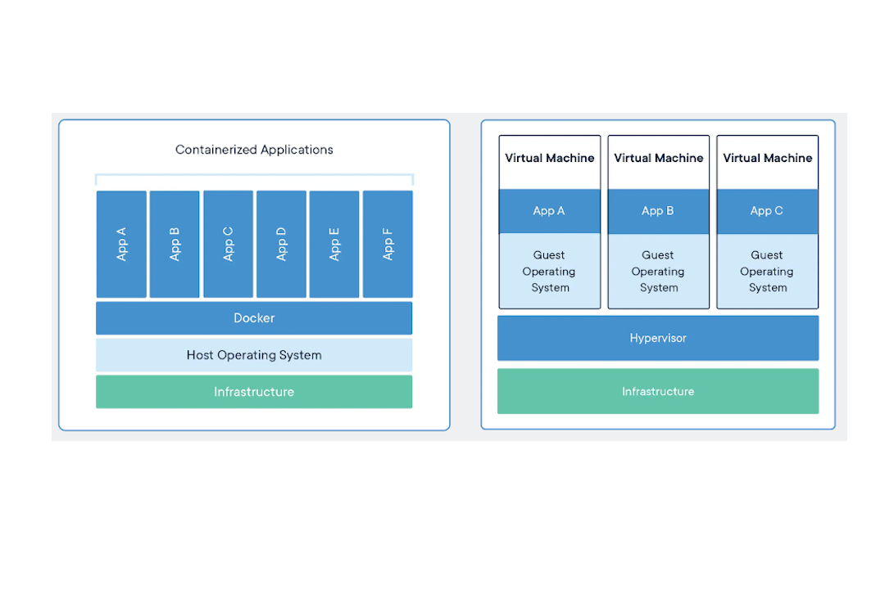
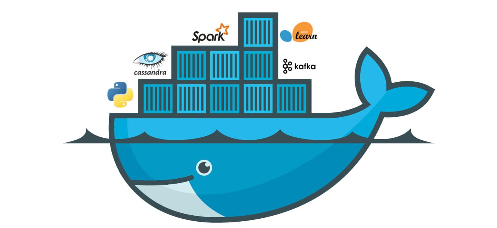
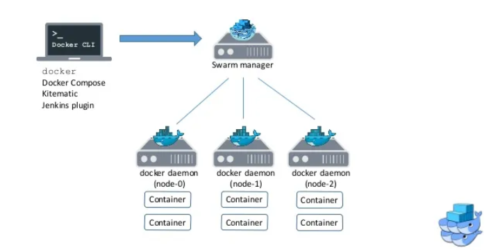

# Docker: Utilização Prática no Cenário de Microsserviços
#

## ****CONCEITUANDO****

### **Microserviços**
Divide os serviços em pequenos serviços que independe do outro. Permite maior escalabilidade e também diminue sua complexibilidade como um todo. Cada serviço pode ter sua linguagem de programação própria e uma equipe focada em cada serviço, as APIs que são bem definidas que irá fazer as integrações...

#
### **Containers**
Os containers permitem rodar as aplicações e serviços de maneira isoladas do sistema operacional. *Um* container é como se fosse *uma* máquina virtaul, a diferença é que o container consegue compartilhar o mesmo kernel do S.O.

#
### **Docker**
Docker é uma empresa que dominou o mercado de containers... no qual permite criar novos containers e gerênciar-los.

#
### **Docker Swarm**
E conhecido como a orquestra do Docker, aonde permite gerenciar/ver os diversos containers.

#
#
## **PRÁTICA**
