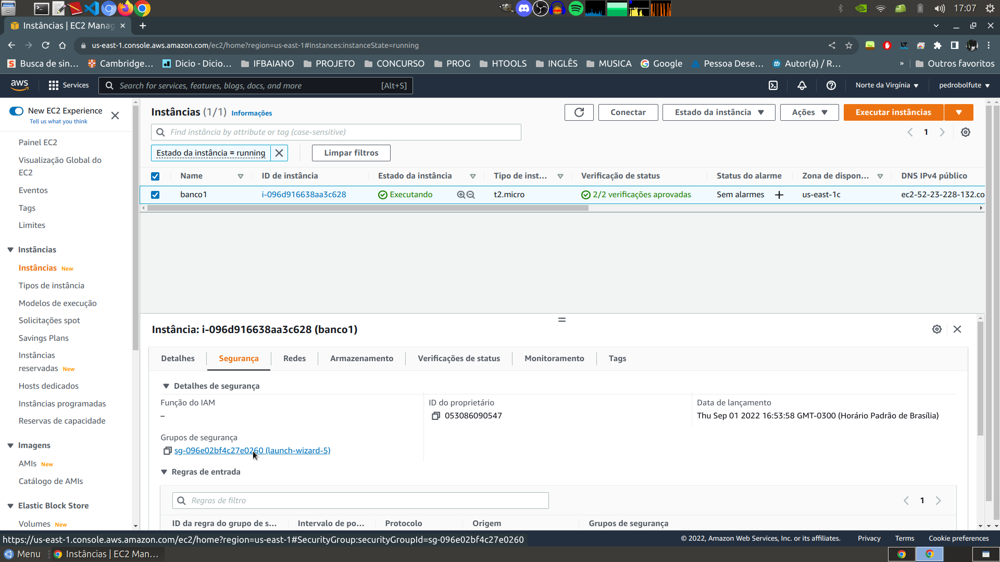
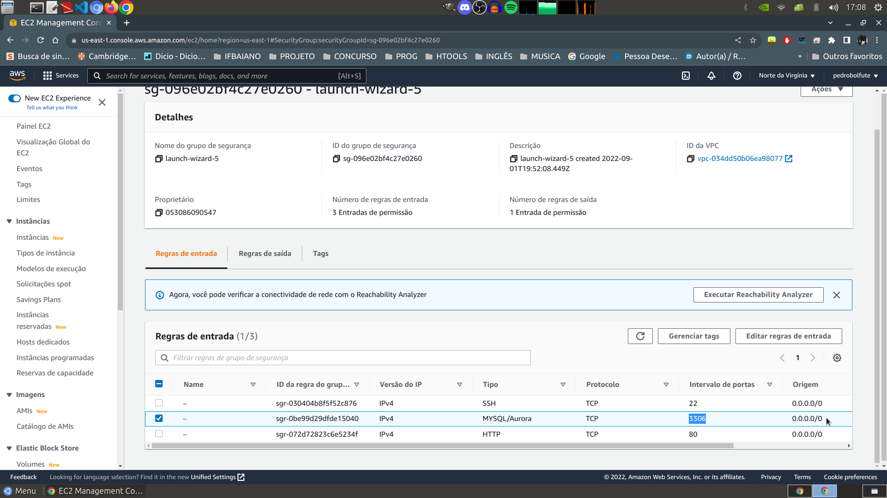

# Docker: Utilização Prática no Cenário de Microsserviços
#

## ****CONCEITUANDO****

### **Microserviços**
Divide os serviços em pequenos serviços que independe do outro. Permite maior escalabilidade e também diminue sua complexibilidade como um todo. Cada serviço pode ter sua linguagem de programação própria e uma equipe focada em cada serviço, as APIs que são bem definidas que irá fazer as integrações...

#
### **Containers**
Os containers permitem rodar as aplicações e serviços de maneira isoladas do sistema operacional. *Um* container é como se fosse *uma* máquina virtaul, a diferença é que o container consegue compartilhar o mesmo kernel do S.O.

#
### **Docker**
Docker é uma empresa que dominou o mercado de containers... no qual permite criar novos containers e gerênciar-los.

#
### **Docker Swarm**
E conhecido como a orquestra do Docker, aonde permite gerenciar/ver os diversos containers.
- temos também os clusters que são os computadores individuais em que as aplicações serão rodadas. O exemplo da escalabilidade pode ser vista por aqui... se um computador começar a ficar sobrecarregado pelas aplicações e serviços, ele pode ser duplicado e compartilhado em outro nó (computador).

#
#
## **PRÁTICA**
**OBJETICO: Criar um Docker Swarm.**
#

## Se for usado o AWS (Amazon Web Server):
### Não esqueça de habilitar a porta padrão que o mysql se comunica (3306)

#

## **Usar Script "docker-install" como ***root*** ou se preferir a instalação manual:**

### Atualizar os pacotes do S.O 
> sudo apt update

### Opção -y confirma já confirma tudo... "S\n"
> sudo apt install docker docker.io -y

### Cria um volume chamado app em /var/lib/docker/volumes
> sudo docker create app

### Cria um volume chamado dados em /var/lib/docker/volumes
> sudo docker create data

### Puxa a imagem mais recente do mysql para dentro do docker "mysql:latest"
> docker pull mysql

### Iniciar o mysql no docker
- --name
  - Coloca o nome do seu banco de dados mysql
- -v
  - Espelha seu volume (pasta) criado acima no diretório original do mysql

- -e
  - Temos uma variável de ambiente que coloca uma senha ao usuário root

- -p
  - Ultilizamos a porta padrão de comunicação do mysql 3306

- -d
  - Rodamos o container que contém o banco em segundo plano. Deixando o terminal livre para trabalhar.
> docker run --name "nome-Do-Seu-Banco" -v /var/lib/docker/volumes/data:/var/lib/mysql -e MY_ROOT_PASSWORD="Sua-Senha-De-Acesso-Ao-Banco-De-Dados" -p 3306:3306 -d mysql:latest

### Confimar se o container está rodando.
- -a
  - Como roda em segundo plano "-d" precisamos listar os processos ocultos (segundo plano) do docker
> sudo docker ps -a

#

### O container vai está em execulsão e seus dados vão ser guardados todos no volume "data" especificado a cima. Se não tivesse criado e especificado esse volume, ele iria criar um volume automaticamente com o nome extenso (ex: 32frec32io890ni9432...). Então se presisar fazer um backup desse container é só copiar o que estiver dentro desse volume.

#